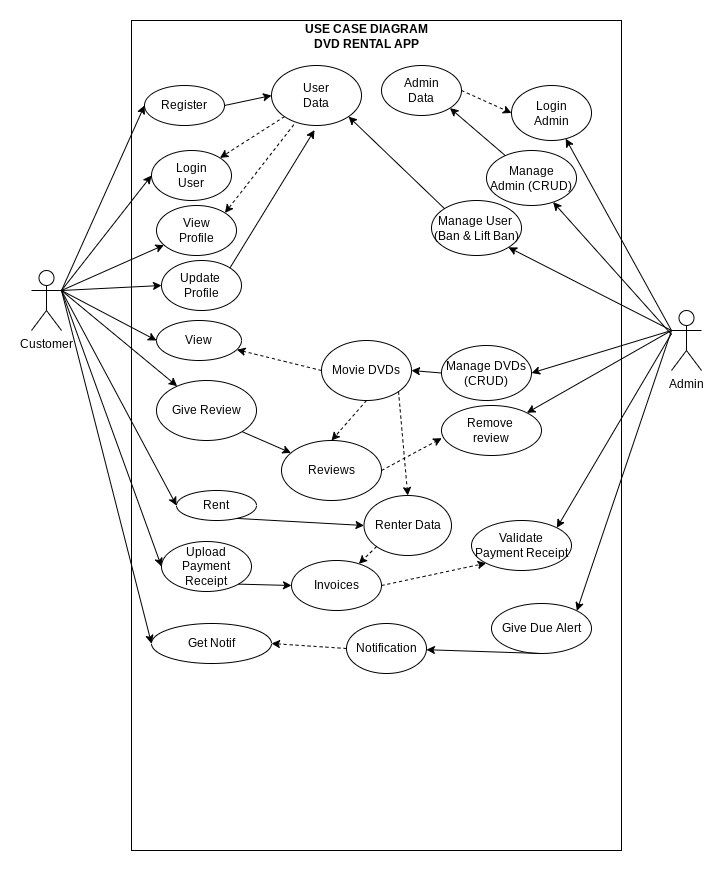
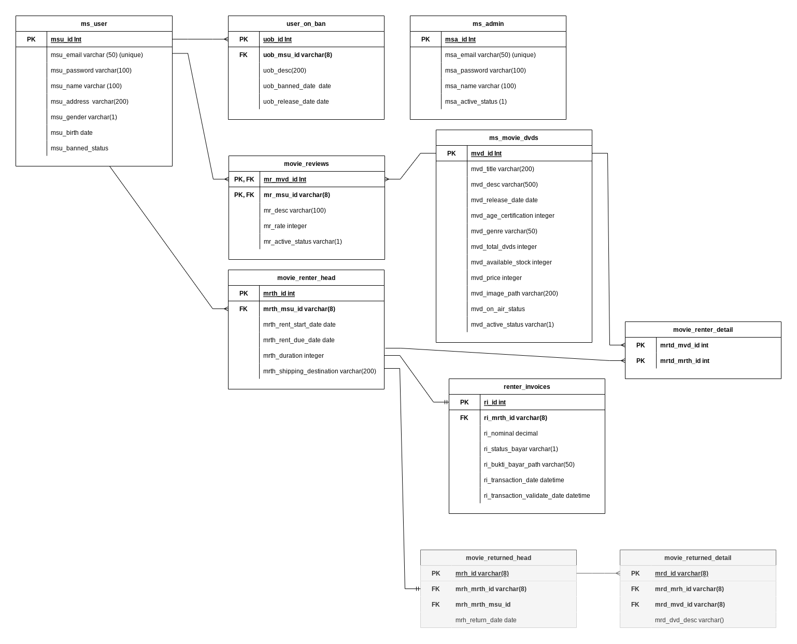
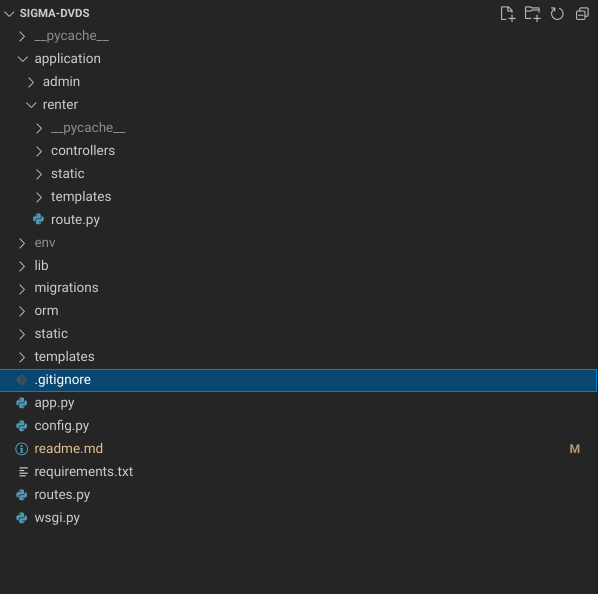

## Table Of Content

1. Introduction
2. Project design
   1. Coverage
   2. Use case diagram
   3. ERD
   4. Tech Stack
   5. Folder structure
3. How to run the program
   1. Download from repository
   2. Dependencies installation
   3. Database Preparation
   4. Run the program
   5. Seeding
4. API

# Introduction

Project ini merupakan hasil teknikal test yang saya kerjakan dengan tema aplikasi rental DVD. Aplikasi ini terbagi menjadi 2 bagian, admin dan user side.

> Admin side digunakan untuk mengelola data dvd film, mengelola akses user, mengelola admin, memvalidasi payment receipt, dan memberikan notifikasi pada peminjaman yang telah melewati batas waktu.
>
> > User side digunakan oleh pengunjung untuk melakan proses pendaftaran, rental, memberikan review dan melakukan pembayaran.

# Project Design

Sebelum proses koding, perlu dibuat rancangan, entah secara detail maupun pada bagian garis2 besarnya saja. Hal ini untuk menghindari program menjadi tidak terarah dan keluar dari output yang diharapkan.

## Coverage

> Admin: CRUD admin, ban & release user, CRUD movie, validasi payment receipt/invoices,dan memberikan notifikasi pada peminjaman melebihi tenggat.

> User: login, register, update profile, meminjam DVD, memberikan review, melihat notifikasi, melihat riwayat peminjaman dan mengupload payment receipt.

## Use Case Diagram

Use Case diagram dibuat untuk memberikan gambaran singkat tentang hubungan aktor/pengguna aplikasi dengan sistem melalui aktivitas-aktivitas yang dilakukannya.

> 

## ERD

ERD dibuat untuk menunjukkan hubungan tabel tabel yang akan dibuat beserta attribute-attribute yang diperlukan.

> 

## Tech Stack

Project ini dibuat dengan menggunakan beberapa spesifikasi teknologi seperti berikut:

> Script dan bahasa pemograman:
>
> - Python
> - Javascript
> - HTML & CSS

> Libary:
>
> - FLASK (python framework)
> - Jquery (Javascript Framework)
> - SB ADMIN 2 Template
> - Bootstrap 5
> - SQL Alchemy (Python ORM)
> - Flask-Migrate (Python Database Migration)
>   Database :
> - PostgreSQL

## Folder Structure

Folder structure pada project ini disusun dengan menggunakan konsep blueprint pada Flask. Blueprint memungkinkan kita membagi aplikasi menjadi modul-modul kecil yang independent.

> 

> wsgi.py merupakan root file program. Dimana program akan dijalankan melalui wsgi.py.

> routes.py tempat untuk mendaftarkan route dari sebuah modul aplikasi.

> app.py tempat pembuatan instance flask untuk kemudian di import pada wsgi.py dan module lainnya.

> config.py berisi configurasi database.

> orm (folder) berisi model-model sqlAlchemy yang dapat digunakan untuk pembuatan tabel pada database (migration) dan query data.

> static (folder) berisi static file.

> templates (folder) berisi file template html yang digunakan secara bersamaan.

> lib (folder) berisi libary python yang dapat digunakan bersama.

> application (folder) berisi modul-modul aplikasi. Tiap module memiliki folder static dan templates masing masing. Tiap endpoint pada module dibuat dalam file route.py sebelum kemudian didaftarkan pada routes.py.

# How To Run The Program

## Download From Repositoy

> Clone atau download source code melalui pada [Github / Obi Kastanya](https://github.com/obikastanya/sigma-movie-dvds-rent).

## Dependencies installation

Package dan library yang diperlukan oleh program ini telah didokumentasikan pada file requirements.txt.
Untuk melakukan installasi, jalankan Comand:

> pip3 install -r requirements.xt

## Database Preparation

> Buat sebuah database dengan nama : sigma_dvds_rent
> Berikut adalah konfigurasi database yang digunakan:

    user='postgres'
    password='root'
    database='sigma_dvds_rent'
    host='localhost'
    port='5432'

> Jika ingin melakukan perubahan configurasi, ubah pada file config.py

## Run the program

Untuk menjalankan program, jalankan command berikut

Linux:

    export FLASK_APP=wsgi
    export FLASK_ENV=development
    export FLASK_DEBUG=1
    flask run --port=8887

Windows:

    set FLASK_APP=wsgi
    set FLASK_ENV=development
    set FLASK_DEBUG=1
    flask run --port=8887

## Seeding

Menu admin hanya dapat dibuka oleh admin, oleh karena itu perlu menjalankan seeding untuk membuat sebuah akun admin default.

> akses url : localhost:8887/admin/api/seed

    email: admin@admin.com
    password: 123456

# API

Response dari restfull api sangatlah simple, ada 3 jenis response yang diberikan. response yang mengembalikan data, response status eksekusi, dan response jika user tidak memiliki akses.

## Api response forbidden access

    {
    	"message": "Forbidden Access",
    	"status": false
    }

## Api response with data

    {
      "data": [
        {
          "active_status": "Y",
          "age_certification": 10,
          "available_stock": 1,
          "desc": "The long nose bleed",
          "genre": "Fantasy",
          "id": 14,
          "image_path": "static/file_storage/dave-ruck-OqaavL4MpJQ-unsplash.jpg",
          "on_air_status": "Y",
          "price": 5000,
          "release_date": "2022-06-14",
          "title": "Pinocio",
          "total_dvds": 1
        }
      ],
      "message": "",
      "status": true
    }

## Api response execution status

    {
      "message": "Alert has been sended",
      "status": true
    }

# API List

Berikut adalah List API yang digunakan:

## Admin side

> /admin/api/users (GET)

> /admin/api/user/ban (POST)

> /admin/api/user/release (POST)

> /admin/api/index (GET)

> /admin/api/index (POST)

> /admin/api/index (PUT)

> /admin/api/index (DELETE)

> /admin/api/index/<id> (GET)

> /admin/api/movie (GET)

> /admin/api/movie (POST)

> /admin/api/movie (PUT)

> /admin/api/movie (DELETE)

> /admin/api/movie/<id> (GET)

> /admin/api/upload (POST)

> /admin/api/invoices (GET)

> /admin/api/invoices/validate (GET)

> /admin/api/login (POST)

> /admin/api/review (DELETE)

> /admin/api/review/<id> (GET)

## User side

> /login (POST)

> /api/register (POST)

> /api/movies (GET)

> /api/review/movie (POST)

> /api/review/movie/<id> (GET)

> /api/movie/rent (POST)

> /api/movie/rent/history (POST)

> /api/alert (POST)

> /api/alert/count (POST)

> /api/rent/invoices (POST)

> /api/invoices/upload (POST)

> /api/invoices/validate (POST)

> /api/user/index (POST)

> /api/user/index (PUT)

## END
